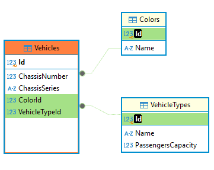

# Fleet Management

Este repositório contém o código-fonte do projeto de gerenciamento de frotas. Siga as instruções abaixo para configurar e executar o projeto localmente de três maneiras diferentes: **usando Docker**, **via CLI**, ou **via IDE**.

---

### Pré-requisitos

Certifique-se de ter os seguintes softwares instalados:

- [.NET Core SDK](https://dotnet.microsoft.com/download) (versão 3.1 ou superior)
- [Docker](https://www.docker.com/get-started) (opcional, para Containeres)
- [IDE com suporte ao .NET](https://visualstudio.microsoft.com/) (como Visual Studio ou Rider)

---

## Assumptions

Esta seção descreve as suposições feitas durante o desenvolvimento do projeto:

- **.NET Core SDK**: Versão 3.1 ou superior instalada.
- **Docker**: Usado para Containerização recomendada.
- **SQL Server**: Usado como SGBD padrão.
- **Visual Studio**: Usado como IDE padrão.
- **Swagger**: Usado para documentação da API.
- **Entity Framework Core**: Usado para mapeamento objeto-relacional.
- **Docker Compose**: Usado para gerenciar múltiplos containeres.
- **Dockerfile**: Usado para criar imagens de containeres.

---

## DER :



## Como Fazer para Rodar o Projeto

### 1. Procedimentos Gerais

1. **Clone o Repositório**:

   ```sh
   git clone https://github.com/yan-karlo/FleetManagement.git
   cd FleetManagement
   ```

2. **Gere o Build das Imagens com Docker Compose**:

   ```sh
   docker-compose build
   ```

3. **Subir os Containeres**:

   Inicie os Containeres no modo interativo para configurar o ambiente:

   ```sh
   docker-compose up -d
   ```

4. **Aplicar Migrations: (Importante)**

    As migrations são aplicadas AUTOMATICAMENTE sempre que o projeto FleetManagement.API for iniciado e que for constatdo que o banco de dados não foi instanciado.

    Se por algum motivo precisar aplicar alguma migration, siga os passos abaixo:


5. **Acessar as Aplicações**:

   As aplicações estarão disponíveis nos containers em:

   - Fleet Management Web App : [http://localhost:61297/home](http://localhost:61297/home)
   - Fleet Management API -Swagger : [http://localhost:8080/api-docs/index.html](http://localhost:8080/api-docs/index.html)

6. **Parar os Containeres**:

   Para encerrar os Containeres, use:

   ```sh
   docker-compose down
   ```

---


Espero que estas instruções ajudem a configurar e executar o projeto. 🚀
"# FleetManagement" 
